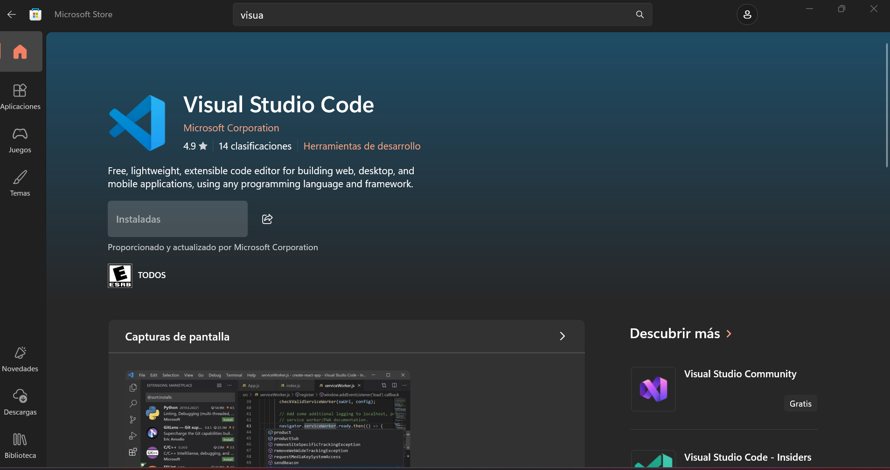
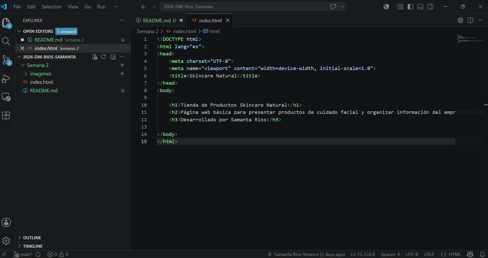
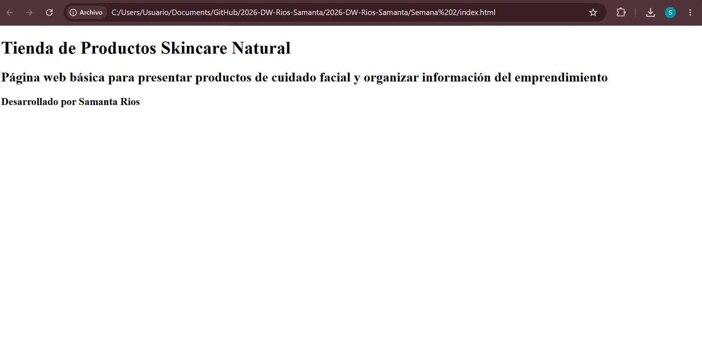

# Actividad Semana 2 - Desarrollo Web

## Tema de la actividad

Herramientas y tecnologías esenciales para el desarrollo web: Visual Studio Code, navegador web y GitHub.

## Descripción de la tarea

En esta actividad utilicé Visual Studio Code para crear un archivo llamado `index.html`.
Dentro del archivo escribí una estructura básica de HTML, incluyendo un título principal, un subtítulo y mi nombre como estudiante.

Luego abrí el archivo en un navegador web para verificar que la página se visualizara correctamente. Finalmente, subí el archivo actualizado a un repositorio de GitHub creado para la asignatura.

## Proyecto desarrollado

El proyecto que desarrollé corresponde a una página web básica para un emprendimiento de productos de skincare.

La página contiene los siguientes elementos:

* Un título principal con la etiqueta `<h1>`.
* Un subtítulo con la etiqueta `<h2>`.
* Un encabezado con mi nombre usando la etiqueta `<h3>`.

## Código principal utilizado

```html
<h1>Tienda de Productos Skincare Natural</h1>
<h2>Página web básica para presentar productos de cuidado facial y organizar información del emprendimiento</h2>
<h3>Desarrollado por Samanta Rios</h3>
```

## Evidencias del desarrollo

### 1. Descarga de Visual Studio Code



### 2. Creación del código en Visual Studio Code



### 3. Visualización de la página web en el navegador



## Enlace del repositorio

El proyecto fue publicado en el siguiente repositorio de GitHub:

https://github.com/sb-riosv/2026-DW-Rios-Samanta

## Estudiante

Samanta Rios Vivanco

## Asignatura

Desarrollo de Aplicaciones Web
